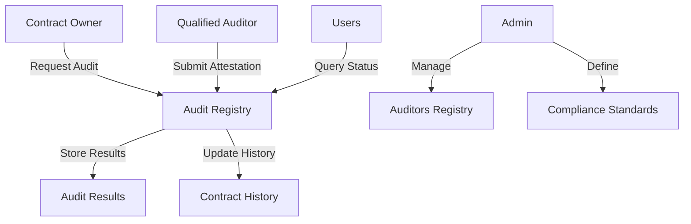

# Chain Compliance Auditor

A decentralized compliance auditing system for Clarity smart contracts on the Stacks blockchain that enables automated verification of contract adherence to established standards and security best practices.

## Overview

Chain Compliance Auditor creates a transparent and trustless environment for smart contract compliance verification without compromising intellectual property. The system allows:

- Contract developers to demonstrate compliance with regulatory frameworks
- Qualified auditors to submit verifiable attestations
- Users to verify contract compliance status
- Storage of cryptographic proofs of compliance checks on-chain

## Architecture

The system is built around a central registry contract that manages the entire compliance auditing workflow.



### Core Components
- Auditors Registry
- Compliance Standards Registry
- Audit Requests Management
- Audit Results Storage
- Contract Audit History

## Contract Documentation

### Chain Auditor Contract

The main contract (`chain-auditor.clar`) manages the entire compliance auditing process.

#### Key Features
- Auditor registration and management
- Compliance standards definition
- Audit request processing
- Result verification and storage
- Audit history tracking

#### Access Control
- Contract Administrator: Manages auditors and compliance standards
- Auditors: Submit audit results
- Contract Owners: Request audits
- Public: Query audit status and history

## Getting Started

### Prerequisites
- Clarinet
- Stacks Wallet
- Access to Stacks blockchain

### Basic Usage

1. Request an audit:
```clarity
(contract-call? .chain-auditor request-audit 
    contract-principal 
    "STANDARD-001" 
    "Initial security audit request")
```

2. Submit audit results (auditors only):
```clarity
(contract-call? .chain-auditor submit-audit
    contract-principal
    "STANDARD-001"
    true
    proof-hash
    "https://report-uri.example"
    "Audit metadata")
```

3. Query compliance status:
```clarity
(contract-call? .chain-auditor is-contract-compliant 
    contract-principal 
    "STANDARD-001")
```

## Function Reference

### Administrative Functions

```clarity
(set-admin (new-admin principal))
(register-auditor (auditor principal) (name (string-ascii 64)) (credentials (string-ascii 128)))
(remove-auditor (auditor principal))
(add-compliance-standard (standard-id (string-ascii 64)) (name (string-ascii 64)) (description (string-utf8 256)) (version (string-ascii 32)))
```

### Audit Management Functions

```clarity
(request-audit (contract-id principal) (standard-id (string-ascii 64)) (description (string-utf8 256)))
(submit-audit (contract-id principal) (standard-id (string-ascii 64)) (result bool) (proof-hash (buff 32)) (report-uri (string-ascii 128)) (metadata (string-utf8 256)))
(cancel-audit-request (contract-id principal) (standard-id (string-ascii 64)))
```

### Query Functions

```clarity
(get-auditor (auditor principal))
(get-compliance-standard (standard-id (string-ascii 64)))
(get-audit-request (contract-id principal) (standard-id (string-ascii 64)))
(get-audit-result (contract-id principal) (standard-id (string-ascii 64)) (auditor principal))
(get-contract-audit-history (contract-id principal))
(is-contract-compliant (contract-id principal) (standard-id (string-ascii 64)))
```

## Development

### Testing

Run tests using Clarinet:
```bash
clarinet test
```

### Local Development

1. Clone the repository
2. Install dependencies: `clarinet requirements`
3. Start local chain: `clarinet console`

## Security Considerations

### Limitations
- Audit results are only as reliable as the auditors' reputation
- On-chain storage of audit results is permanent
- Proof verification is dependent on off-chain mechanisms

### Best Practices
- Always verify auditor credentials before trusting results
- Use cryptographic proofs to validate audit findings
- Monitor contract audit history for any changes or updates
- Implement proper access controls when interacting with the contract